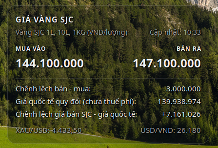

# sjc-gold@binhnguyensoft.com
Widget hiển thị giá vàng SJC trên Desktop cho GNOME Shell

## Screenshot



## Data

- SJC buy/sell prices
- buy/sell spread
- XAU/USD spot
- Vietcombank USD/VND sell rate
- international gold price converted to VND/lượng
- SJC sell premium over converted international price

## UI

- refresh every 5 minutes after a successful update
- manual refresh button
- draggable desktop position, saved under `~/.config/sjc-gold-widget/position.json`
- partial market-data failures are shown as a warning while valid SJC data remains visible

## Yêu cầu

Mình làm cho máy mình đang dùng Ubuntu 26.04 và GNOME 50. Dù metadata mình đang để hỗ trợ từ GNOME 45 trở lên nhưng mình chưa kiểm thử.

Máy cần có Python và thư viện `curl_cffi`. Kiểm tra thư viện đã được cài chưa bằng:

```bash
python3 -c 'import curl_cffi; print(curl_cffi.__version__)'

Nếu báo lỗi ModuleNotFoundError, cài bằng:

```bash
pip install curl_cffi
```

## Cài đặt

Bạn có thể cài Extension Manager để dễ thao tác bằng giao diện.

Download repository rồi mở **Terminal** chạy lệnh:

```bash
gnome-extensions install --force sjc-gold@inhnguyensoft.com
```

Hoặc giải nén rồi copy thư mục `sjc-gold@inhnguyensoft.com` vào `~/.local/share/gnome-shell/extensions`.

Nếu extension không hiển thị, hãy logout rồi login lại, sau đó, bật bằng giao diện hoặc chạy lệnh:

```bash
gnome-extensions enable sjc-gold@binhnguyensoft.com
```
