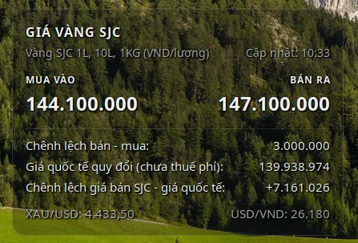
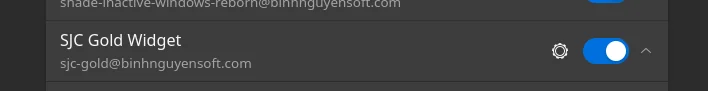
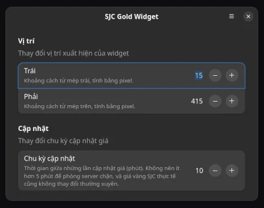

# Widget giá vàng SJC cho Linux GNOME

Widget hiển thị giá vàng SJC trên Desktop cho GNOME Shell, kèm giá quốc tế quy đổi và chênh lệch.

## Screenshot



## Giới thiệu

Linux Desktop Widget GNOME Shell cho bạn nào quan tâm giá vàng trong nước và thế giới. Dữ liệu hiển thị bao gồm:

- Giá mua và giá bán SJC (1 lượng)
- Chênh lệch giá bán - mua
- Giá thế giới giao ngay XAU/USD 
- Giá bán USD Vietcombank
- Giá thế giới giao ngay quy đổi chưa bao gồm thuế phí
- Chênh lệnh giá bán SJC và giá thế giới quy đổi chưa bao gồm thuế phí
- Dữ liệu cập nhật 5 phút/lần

## Yêu cầu

Máy cần có Python và thư viện `curl_cffi`. Kiểm tra thư viện đã được cài chưa bằng:

```bash
python3 -c 'import curl_cffi; print(curl_cffi.__version__)'
```

Nếu báo lỗi ModuleNotFoundError, cài bằng:

```bash
pip install curl_cffi
```

## Cài đặt

Bạn có thể cài Extension Manager để dễ thao tác bằng giao diện.

Download repository, giải nén, đổi tên thư mục thành `sjc-gold@binhnguyensoft.com` rồi mở **Terminal** chạy lệnh:

```bash
gnome-extensions install --force sjc-gold@binhnguyensoft.com
```

Hoặc giải nén rồi copy thư mục `sjc-gold@binhnguyensoft.com` vào `~/.local/share/gnome-shell/extensions`.

Nếu extension không hiển thị, hãy logout rồi login lại, sau đó, bật bằng giao diện hoặc chạy lệnh:

```bash
gnome-extensions enable sjc-gold@binhnguyensoft.com
```

## Tùy chỉnh



Mặc định, dữ liệu cập nhật 5 phút một lần, vị trí xuất hiện widget: trên 15px, trái 15px. Nếu muốn thay đổi, mở app Extension Manager, sẽ có nút Cài đặt xuất hiện ngay dòng SJC Gold Widget, bấm vào nó để thay đổi. KHUYÊN CÁO: đừng nên cập nhật quá thường xuyên để tránh trường hợp server SJC chặn. Giá SJC cũng không thay đổi nhanh nên 5 - 10 phút hãy cập nhật một lần.


